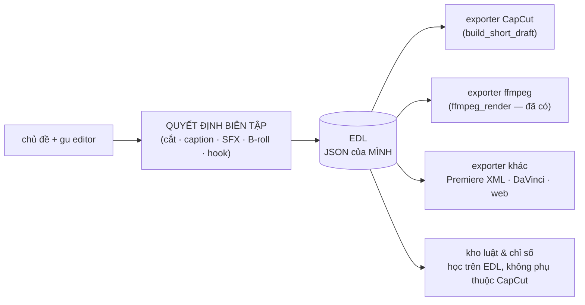

# Lộ trình: từ công cụ dựng draft → nền tảng biên tập tự tiến hoá

> Bốn mục tiêu người dùng đặt ra: (1) editor tự động, tự học, tự tiến hoá · (2) quản lý
> project + tài nguyên CapCut bằng dashboard · (3) agent tư vấn dài hạn · (4) không dừng
> ở một phiên bản, sau này tách khỏi CapCut cũng được.
>
> Tài liệu này soi từng mục: **đang có gì, thiếu gì, làm theo thứ tự nào và vì sao**.

---

## 0. Số liệu làm nền (đo trên máy dev, 25/07/2026)

| Đo | Kết quả | Ý nghĩa |
|---|---|---|
| Gói tài nguyên đã tải trong CapCut | **354 gói · 448 MB** | Cache `effect` + `artistEffect` |
| Từng được dùng thật trong draft | **19** | Đối chiếu `resource_id` qua 25 draft |
| **Tải về chưa bao giờ dùng** | **335 (95%)** | CapCut không có màn hình nào cho biết |
| Kho app đã học được | 43 tài nguyên (Đan 26 / Nguyên 17) | Chỉ học từ draft, chưa đụng tới cache |
| Draft đã dựng | 25 | Chưa có trạng thái vòng đời nào |

Hai kết luận rút ra:

1. **Kho hiện tại đang mù một nửa.** Nó chỉ biết tài nguyên *đã dùng trong draft*, không
   biết editor *có sẵn những gì*. Muốn tư vấn "dùng cái này đi" thì phải thấy cả kho đã tải.
2. **Tên hiển thị chỉ có trong draft.** `config.json` trong gói cache chỉ có tên nội bộ
   (`star`, `mirror`); tên thật (`cc_印加太阳神之辉`, `弹出变色-粉`) nằm ở `materials[].name`
   của draft. Dashboard phải **hợp nhất hai nguồn**, không nguồn nào đủ một mình.

---

## 1. Mục tiêu 1 — Editor tự động, tự học, tự tiến hoá

### Đang có
Vòng học một chiều: dựng draft → chụp mốc → editor sửa trong CapCut → diff → tài nguyên
thêm vào kho (`use_count++`), tài nguyên bị gỡ bị hạ điểm (`drop_count++`). Lần dựng sau
chọn theo `use_count - drop_count*2`.

### Thiếu — và đây là chỗ quyết định
| Thiếu | Vì sao quan trọng |
|---|---|
| Học **cách dùng**, không chỉ **dùng cái gì** | Hiện chỉ đếm tài nguyên. Không học: caption đặt ở đâu, cỡ bao nhiêu, nhịp cắt bao lâu, SFX rơi vào loại khoảnh khắc nào, hook dài mấy giây. Đó mới là "gu". |
| **Hàm mục tiêu** để biết mình có khá lên không | Không đo được bản tháng này có tốt hơn tháng trước không → "tiến hoá" chỉ là niềm tin. |
| Tín hiệu **kết quả** (view/giữ chân) | Hiện chỉ học theo sở thích editor, không học theo cái chạy được. |
| **A/B**: mỗi chủ đề chỉ dựng đúng một bản | Không có gì để so, nên không có gì để chọn. |

### Đề xuất then chốt: chỉ số "ĐỘ PHẢI SỬA"

> Thước đo tiến hoá = **editor phải sửa bao nhiêu thì draft mới dùng được**.
> Càng ngày càng phải sửa ít = app càng hợp gu. Con số này giảm dần theo tháng chính là
> bằng chứng "tự tiến hoá", thay cho cảm tính.

Dữ liệu đã có sẵn: `snapshots/` giữ mốc trước, draft sau khi editor lưu là mốc sau. Chỉ
cần **mở rộng `draft_diff.py`** từ "tài nguyên thêm/gỡ" sang cả: segment bị cắt/dời,
caption bị sửa chữ, thời điểm bị đẩy, âm lượng bị chỉnh, transition bị đổi.

Từ cùng dữ liệu đó rút ra **luật dựng** (rule store) thay cho việc chỉ đếm:
`"Đan luôn đổi font sang comicbd"` · `"Nguyên luôn kéo hook ngắn lại còn ≤2.5s"` ·
`"SFX pop chỉ dùng ở chỗ chuyển ý, không dùng ở hook"`.

---

## 2. Mục tiêu 2 — Quản lý project & tài nguyên bằng dashboard

### Quét được những gì (đã kiểm chứng trên máy thật)

| Nguồn | Có gì | Ghi chú |
|---|---|---|
| `Cache/effect`, `Cache/artistEffect` | 354 gói: `resource_id`, kích thước, thời điểm tải, `config.json` (tên nội bộ + version), ảnh `singleImage.png`/`final.gif` | Đây là "đã tải" |
| `draft_content.json` của 25 draft | tên hiển thị thật, `resource_id`, số lần dùng, dùng ở draft nào | Đây là "đã dùng" |
| `Cache/music` (200), `Resources/Font`, `Cache/fontImage` (7.606) | nhạc + font đã tải | Chưa quét |
| `Presets/Adjust`, `Presets/Combination`, `Presets/Text_V2` | **preset do chính editor lưu tay** | Mỏ vàng để học gu, chưa đụng tới |
| `Config/globalSetting` | vị trí thư mục draft | Đã dùng để dò CapCut |

**Không có** CSDL catalog nào trong CapCut (đã quét: 0 file SQLite ngoài cache) → phải tự
dựng inventory và tự hợp nhất.

### Dashboard trả lời được những câu CapCut không trả lời
- Đã tải 448 MB, thật sự dùng bao nhiêu? Xoá được bao nhiêu?
- Tài nguyên nào tải về rồi bỏ xó 6 tháng?
- Gu mỗi editor: ai hay dùng gì, ai gỡ gì ra khỏi draft app dựng?
- Mỗi dự án đang ở đâu trong vòng đời: đã phân tích → đã dựng → editor đã sửa → đã đồng
  bộ về kho → đã xuất bản?
- Draft nào đang chiếm ổ cứng mà đã xuất bản xong (dọn được)?

---

## 3. Mục tiêu 3 — Agent tư vấn dài hạn

### Đang có
12 tool, nhớ hội thoại trong bảng `chat` của `library.db`, một phiên `default`.

### Thiếu
| Thiếu | Hậu quả hôm nay |
|---|---|
| Bộ nhớ **có cấu trúc**, tách khỏi transcript | Nhớ theo kiểu đọc lại 40 lượt chat gần nhất. Ba tháng nữa thì hoặc phình context hoặc quên sạch. |
| Agent **đọc được kết quả học** | Không tư vấn được "chủ đề này hợp gu Nguyên hơn vì..." — nó không thấy kho tri thức. |
| Tóm tắt định kỳ | Không có cơ chế nén lịch sử dài. |
| Chủ động | Không bao giờ tự nói "3 draft đã 2 tuần chưa đồng bộ về kho". |

### Đề xuất
Tách bộ nhớ làm 3 loại, agent tự ghi khi phát hiện: **sự việc** (đã làm gì, khi nào) ·
**sở thích/luật** (Đan thích font X) · **quyết định** (đã chốt bỏ Pexels cho tuyến B).
Cộng thêm tool đọc dashboard + rule store để tư vấn có căn cứ chứ không đoán.

---

## 4. Mục tiêu 4 — Không khoá vào CapCut

### Vấn đề kiến trúc hiện tại
`build_short_draft.py` (~1.100 dòng) làm hai việc trộn nhau: **quyết định biên tập**
(cắt ở đâu, caption gì, SFX nào, hook nào) và **phẫu thuật JSON của CapCut** (clone donor,
remap GUID, `material_text_ranges` tính theo byte...). Muốn đổi đích xuất là phải mổ lại
toàn bộ.

### Đề xuất: chèn một lớp trung gian — EDL

Ba cái lợi, theo thứ tự quan trọng:
1. **Luật học được gắn vào EDL, không gắn vào JSON CapCut** → CapCut đổi format hay bỏ
   CapCut thì tri thức tích luỹ vẫn còn nguyên.
2. Diff/đo "độ phải sửa" làm trên EDL sạch hơn nhiều so với dò trong JSON CapCut.
3. `ffmpeg_render.py` vốn đã là exporter thứ hai → mô hình này không phải lý thuyết.

> **Thời điểm:** phải làm **trước** khi xây rule store, nếu không luật sẽ viết bám vào
> cấu trúc CapCut và phải viết lại từ đầu.

---

## 5. Nợ tồn đọng (ngoài 4 mục tiêu)

| Nợ | Mức | Ghi chú |
|---|---|---|
| **Không có test tự động nào** | 🔴 cao | App sắp phát triển dài hạn mà mỗi lần sửa phải mở trình duyệt bấm tay. Đây là thứ chặn tốc độ mọi giai đoạn sau. |
| Data 1.4 GB nằm trong cây mã nguồn | 🟠 vừa | Draft giữ path tuyệt đối vào `shorts/work` → cần script migration mới dời được |
| Kho là **local một máy** | 🟠 vừa | `library.db` + `assets/user/` nằm trên máy Đan thì máy Nguyên không thấy. Muốn "team học chung" phải có cách gộp kho. |
| Chưa đóng gói `.exe` | 🟡 thấp | Đã đo phương án (một app, gói CUDA 736 MB tuỳ chọn) |
| `shorts/` chưa là package | 🟡 thấp | Còn `sys.path.insert` |

---

## 6. Thứ tự đề xuất

| GĐ | Việc | Vì sao đặt ở đây |
|---|---|---|
| **1** | **Inventory + Dashboard**: quét cache CapCut, hợp nhất với kho, tab thống kê; trạng thái vòng đời cho project/draft | Giá trị thấy ngay, không đụng kiến trúc, và tạo ra dữ liệu mà mọi giai đoạn sau đều cần |
| **2** | **EDL**: tách quyết định biên tập khỏi phẫu thuật JSON CapCut | Làm trước rule store, nếu không phải viết lại |
| **3** | **Học sâu**: diff mở rộng (timing/caption/âm lượng) → chỉ số "độ phải sửa" → rule store trên EDL | Cần EDL ở GĐ2 và dữ liệu ở GĐ1 |
| **4** | **Agent dài hạn**: bộ nhớ có cấu trúc + tool đọc dashboard/rule store + tóm tắt phiên | Agent chỉ tư vấn giỏi khi đã có tri thức của GĐ1-3 để đọc |
| **xen kẽ** | **Bộ test tự động** cho pipeline + API | Càng để lâu càng đắt; nên bắt đầu ngay từ GĐ1 |

Nguyên tắc xuyên suốt, giữ nguyên từ giai đoạn hiện tại: **đừng ép AI đoán giỏi hơn —
để editor sửa rồi máy học lại** (bài học mục 10.1 của `WORKFLOW.md`).
