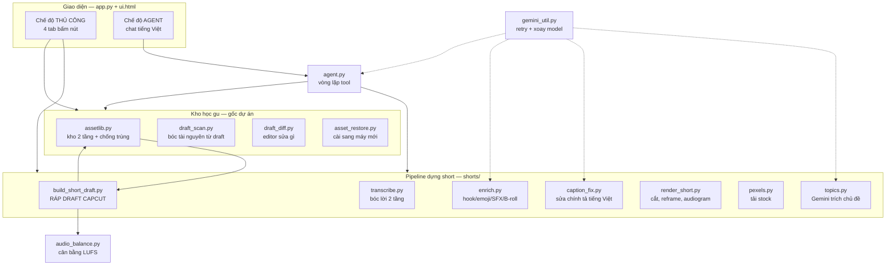
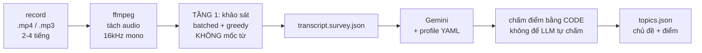
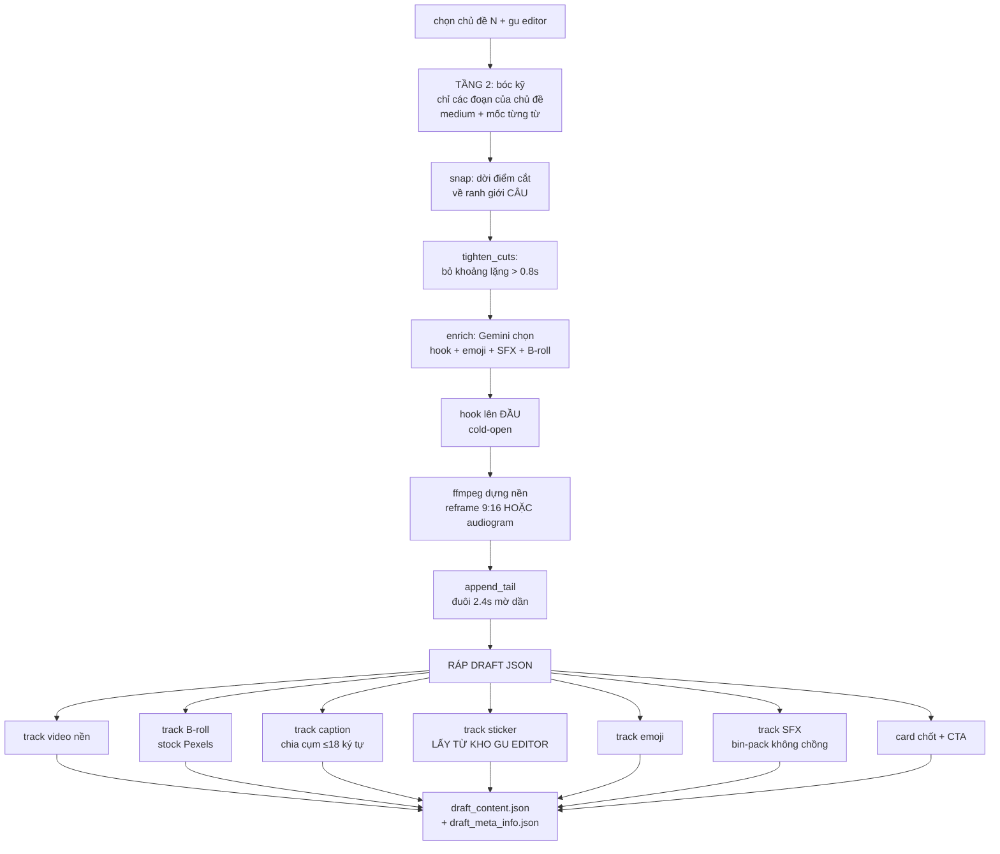
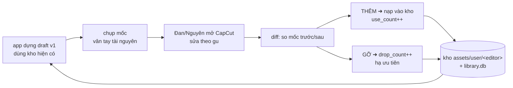
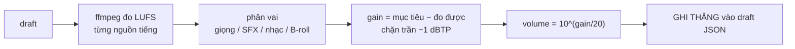
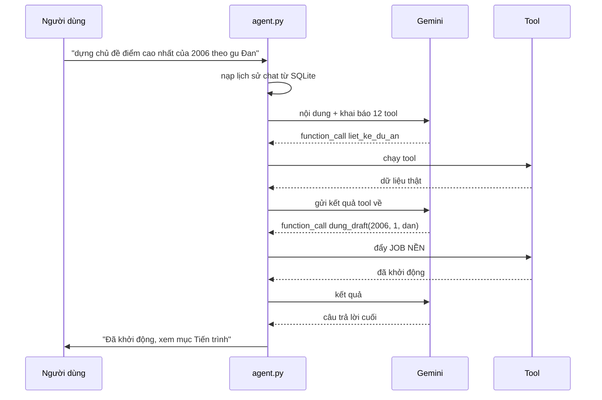
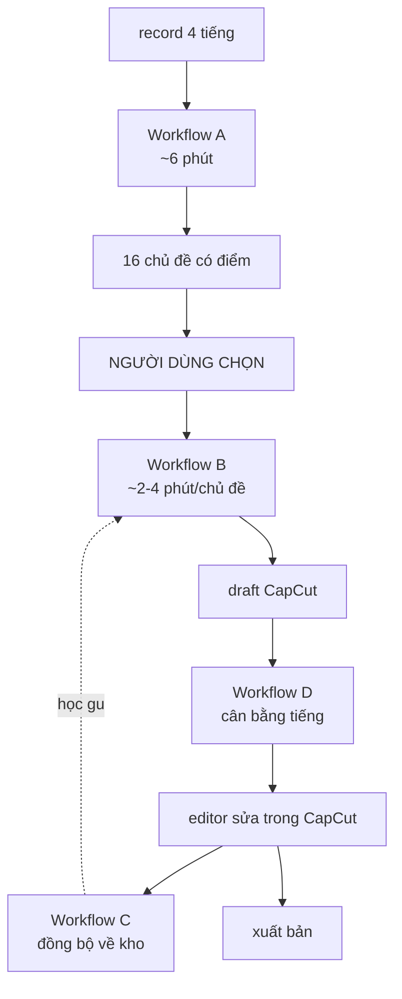

# Toàn bộ workflow & cơ chế vận hành

> Hệ thống biến **1 buổi ghi hình/ghi âm dài 2-4 tiếng** thành **nhiều short dạng DỰ ÁN CapCut
> còn sửa được**, và **học dần gu của từng editor** để lần sau tự lên đúng phong cách.
>
> Điểm khác Opus Clip: nó xuất video đã render — sửa không được. Ta xuất **draft CapCut**,
> editor mở ra chỉnh tiếp bình thường. Và kho tài nguyên tiến hoá theo người dùng.

~4.700 dòng Python, 24 module. Tài liệu này giải thích **cái gì chạy khi nào, và tại sao làm vậy**.

---

## 1. Bản đồ module



**Nguyên tắc kiến trúc xuyên suốt:** ffmpeg **nướng sẵn** phần nền (khung 9:16, cắt ghép,
audiogram) thành 1 file mp4; CapCut draft chỉ chứa các lớp **CHỈNH ĐƯỢC** (caption, sticker,
SFX, B-roll, emoji). Nướng hết vào video thì editor mất quyền sửa; để hết trong CapCut thì
CapCut đứng hình.

---

## 2. Workflow A — Record thô ➜ danh sách chủ đề



**Vào:** đường dẫn file. **Ra:** `shorts/work/<tên>/topics.json`.

Chi tiết đáng chú ý:

- **Tầng 1 chỉ cần "đủ tốt để tìm chủ đề"**, không cần chính xác từng chữ. Nên bỏ mốc từng từ,
  dùng giải mã tham lam, gom lô 16 — nhanh gấp ~5 lần (mục 9.1).
- **Điểm do code tính, không do LLM tính.** LLM chấm từng tiêu chí trong
  `profiles/meeting.yaml`, code nhân trọng số rồi lọc theo ngưỡng. LLM tự cho điểm tổng thì
  điểm trôi và không giải thích được.
- **Chủ đề = nhiều đoạn RỜI ghép lại.** Người nói hay quay lại ý cũ; 1 chủ đề có thể gồm 2-4
  đoạn ở các mốc khác nhau.
- **Record chỉ có tiếng vẫn chạy bình thường** ở bước này (chỉ khác ở bước dựng hình).

---

## 3. Workflow B — Chủ đề ➜ draft CapCut

Đây là workflow phức tạp nhất. `build_short_draft.py` điều phối:



### Các bước then chốt

**1. Snap về ranh giới câu.** Mốc thời gian LLM đưa ra là *áng chừng*. Không snap thì cắt
giữa câu. `snap()` tìm khoảng lặng lớn nhất quanh điểm cắt trong cửa sổ ±4s.

**2. Cắt khoảng lặng** (`tighten_cuts`). Short mà chết vài giây là mất người xem. Tách mỗi
đoạn thành nhiều đoạn nhỏ nhảy qua chỗ im, chừa 0.15s hai mép cho đỡ cụt hơi.

**3. Cold-open.** Hook không phải chữ chạy trên màn hình mà là **khoảnh khắc ấn tượng nhất
được kéo lên đầu video**. AI chọn câu gây tò mò nhất, đoạn đó được ghép vào trước phần thân.

**4. Nền: reframe hay audiogram?** `has_video()` kiểm tra luồng hình:
- Có hình → khung 9:16 nền mờ + video gốc đặt giữa.
- Chỉ có tiếng → **audiogram**: gradient chuyển động + sóng âm.

**5. Ráp draft.** Không dùng thư viện nào — ghi thẳng JSON của CapCut, clone cấu trúc từ draft
mẫu (`282new`) rồi remap toàn bộ GUID. Chi tiết ở mục 9.4.

---

## 4. Workflow C — Vòng học gu editor ⭐

Đây là thứ khiến hệ thống khác biệt, và là **giải pháp cho một thất bại**: thử 2 vòng bắt AI
chọn stock cho khớp mood đều hỏng (mục 10.1). Kết luận: đừng ép AI đoán giỏi hơn — **để editor
sửa rồi máy học lại**.



**Cơ chế chống trùng lặp 2 khoá** (yêu cầu gốc: "tránh lưu duplicate"):
- `resource_id` — CapCut cấp, ổn định toàn cầu, dùng cho sticker/hiệu ứng chữ/transition.
- `sha256` nội dung — dùng cho file local (SFX/font/stock), vì **cùng một file trên máy Đan và
  máy Nguyên sẽ có đường dẫn khác nhau**.

Đã có thì chỉ `use_count++`, **không copy lần hai**. Seed từ 4 draft thật của team: 43 tài
nguyên vào kho, **106 lượt trùng bị chặn**.

**Chọn tài nguyên khi dựng draft:** kho user (đúng editor) → shared → default → stock API.
Điểm xếp hạng `use_count - drop_count*2` — cái bị gỡ nhiều lần sẽ tự chìm xuống.

---

## 5. Workflow D — Cân bằng âm thanh



Đo theo **ITU-R BS.1770 / EBU R128** (đơn vị LUFS), không dùng peak thô vì peak không phản ánh
cảm nhận to-nhỏ của tai người.

| Nguồn | Mục tiêu | Vì sao |
|---|---|---|
| Giọng nói | **−14 LUFS** | chuẩn TikTok/YouTube/Reels chuẩn hoá về mức này |
| SFX | −16 LUFS | dưới giọng 2 dB: nhấn được mà không giật mình |
| Nhạc nền | −30 LUFS | thấp hơn giọng ~16 dB (nghiên cứu: SNR ≈ +15 dB thì nghe rõ gần tối đa) |
| Trần | ≤ −1 dBTP | tránh méo sau khi nén codec |

**Không re-encode.** Chỉ ghi `volume` (hệ số nhân tuyến tính) vào từng segment → editor mở
CapCut vẫn kéo tay chỉnh được, và lần sau app học luôn cái họ chỉnh.

---

## 6. Workflow E — Mang sang máy mới

Sticker/hiệu ứng chữ/transition phải **bấm tải trong CapCut** mới có, nằm ở
`<LOCALAPPDATA>/CapCut/User Data/Cache/{effect|artistEffect}/<resource_id>/<hash>/`.
Draft trỏ đường dẫn tuyệt đối vào đó → máy mới mở là thiếu.

Vì kho đã giữ **nguyên cả gói effect** (thư mục, không chỉ ID):

```
asset_restore.py --check    → máy này thiếu gì
                 --restore  → đổ gói từ kho vào đúng cache CapCut
                 --fix-draft→ rewrite đường dẫn cho khớp LOCALAPPDATA máy đó
```

Đã kiểm chứng bằng cách giả lập máy trắng: khôi phục **15/15 gói, khớp byte-for-byte**.

---

## 7. Hai chế độ vận hành

| | **Thủ công** | **Agent** |
|---|---|---|
| Giao diện | 4 tab bấm nút | chat tiếng Việt |
| Hợp với | thao tác quen, nhanh | lệnh tự do, nhiều bước |
| Trí nhớ | không | nhớ ngữ cảnh (SQLite) |
| Ai dùng | editor | người điều phối |

**Agent hoạt động thế nào:**



Việc nặng **không chạy trong lượt chat** — đẩy sang job nền rồi báo lại, tránh chẹn cả phiên.

---

## 8. Vòng đời một dự án (toàn cảnh)



---

## 9. Bảy cơ chế then chốt

### 9.1 Bóc lời 2 tầng — nhanh gấp 5, chất lượng lại cao hơn

Chẩn đoán ban đầu tưởng nghẽn GPU, **đo ra thì ngược lại**: VRAM chỉ dùng 1.4/4 GB,
utilization 51-87% → **GPU bị bỏ đói**, nghẽn ở khâu điều phối và ở các tham số mặc định rất đắt
(beam 5, best_of 5, 6 mức temperature fallback, `condition_on_previous_text=True` gây trôi/lặp
trên file dài → kích hoạt chính cái fallback đó).

| Cấu hình (clip 8 phút) | Thời gian | Tốc độ |
|---|---|---|
| Mặc định | 56.7s | 8.5x |
| greedy + tắt condition | 46.7s | 10.3x |
| bỏ mốc từ | 43.7s | 11.0x |
| **batched(16) + greedy + bỏ mốc từ** | **11.1s** | **43.3x** |

Nên tách: **tầng 1** quét cả file bằng cấu hình nhanh (chỉ để tìm chủ đề) → **tầng 2** bóc kỹ
bằng `medium` + mốc từng từ **chỉ trên đoạn được chọn**.

Vừa nhanh hơn **vừa cho caption đẹp hơn**: không ai kham nổi `medium` cho 4 tiếng, nhưng thừa
sức cho 3 phút.

⚠️ Cạm bẫy: `sorted(glob("transcript.*.json"))[-1]` sẽ chọn nhầm `survey` (xếp chữ cái đứng
cuối) — bản không có mốc từ. Phải dùng `load_transcript()` với thứ tự ưu tiên fine > cũ > survey.

### 9.2 `src_to_out()` — cái trục giữ mọi thứ khớp nhau

Short = nhiều đoạn nguồn rời ghép lại (hook + các đoạn thân + đã cắt lặng). Mọi cue của AI
(emoji giây 631, SFX giây 646...) đều theo **mốc file gốc**, phải đổi sang **mốc video output**.

Hàm này là trục: đổi được nó thì caption/emoji/SFX/B-roll **tự khớp lại hết**. Nhờ vậy việc
cắt khoảng lặng chỉ tốn ~30 dòng — chỉ cần tách `cuts` thành nhiều mảnh hơn.

⚠️ Cue rơi trúng khoảng lặng vừa cắt thì **dời về mép gần nhất**, không bỏ. Bỏ thì mất đúng
những SFX đặt ở chỗ chuyển ý (đã đo: SFX rớt 21 → 13).

### 9.3 Kho 2 tầng + chống trùng 2 khoá

Xem mục 4. Điểm tinh tế: **gói effect của CapCut là THƯ MỤC**, không phải file đơn — phải hash
và copy theo thư mục, và trên Windows cần tiền tố đường dẫn dài `\\?\` vì tên file trong gói
vượt giới hạn 260 ký tự.

### 9.4 Phẫu thuật JSON của CapCut

`draft_content.json` là **JSON thuần, không mã hoá**. Mọi thời gian tính bằng **micro giây**.
Cấu trúc `tracks[].segments[]` → `material_id` + `extra_material_refs[]`, dính nhau bằng GUID.

Cách làm: clone nguyên cụm từ draft mẫu → **remap toàn bộ GUID** → thay nội dung. Sau đó
`integrity()` đếm tham chiếu mồ côi, luôn phải bằng **0**.

Ba cái bẫy đã trả giá:
- Giữ nguyên `music_id` của nhạc online từ draft mẫu → CapCut **gộp cả 15 SFX thành một tiếng**.
  Phải "địa phương hoá": `type=extract_music`, `category_name=local`, `music_id` GUID riêng.
- Giữ nguyên `icon_url`/`preview_cover_url` → **thumbnail timeline khác hẳn video** (CapCut vẽ
  timeline từ URL, vẽ canvas từ path). Phải blank hai trường đó.
- Đường dẫn media phải **tuyệt đối**, và phải điền `draft_materials` trong meta, nếu không
  CapCut đòi chọn lại đường dẫn.

### 9.5 Nướng sẵn vs để chỉnh được

| Nướng vào mp4 (ffmpeg) | Để trong draft (chỉnh được) |
|---|---|
| khung 9:16, nền mờ | caption |
| cắt ghép, bỏ lặng | sticker, emoji |
| audiogram | SFX |
| đuôi kết mờ dần | B-roll |
| | âm lượng |

Ranh giới này do một thất bại định ra: bản v1 nhét 28 caption template vào draft làm **CapCut
báo đỏ và đứng hình**. Chuyển sang text thường thì hết.

### 9.6 Chống 503 & xoay tua model

Gemini trả 503 (quá tải) nhiều lần trong quá trình làm. `gemini_util` gom một chỗ: lỗi quá tải
→ chờ giãn dần rồi thử lại; hết lượt → **xoay sang model kế tiếp**; `parsed=None` (output vượt
giới hạn) cũng coi là hỏng.

⚠️ Kèm nguyên tắc: **không cache kết quả tệ**. Từng có lần 0/41 dòng caption sửa được nhưng
vẫn ghi cache rỗng → mọi build sau dùng lại cache đó, caption vĩnh viễn không được sửa **mà
không báo gì**. Giờ chỉ cache khi đạt ≥50%.

### 9.7 Chia lô mọi thứ gửi LLM

Record 4 tiếng → 16 chủ đề → 755 dòng caption gửi một lần → vượt giới hạn output → `parsed`
về None → **gãy cả build**. Không lộ với record 2 tiếng (227 dòng). Giờ chia lô 120 dòng, một
lô hỏng không làm hỏng cả build.

---

## 10. Hai quyết định lớn rút ra từ thất bại

### 10.1 Stock tự động không cứu được mood

Thử 2 vòng: prompt "bám mood & câu chuyện", rồi siết query. Vẫn hỏng. Xem tận mắt clip Pexels
trả về:

| Query gửi đi | Nhận về |
|---|---|
| "person telling story, expressive face" | một bà cụ Tây ngẫu nhiên |
| "endless loop, hamster wheel, stuck" | **một anh đạp xe BMX** (match chữ "cycle") |

Hai lý do gốc: stock keyword-search **không hiểu ẩn dụ**, và người-lạ-corporate **không khớp
câu chuyện tiếng Việt cụ thể**. → Chuyển sang human-in-the-loop (mục 4).

### 10.2 Đóng gói: một app, CUDA là gói tuỳ chọn

Đo ra: `nvidia/` chiếm 2.0 GB. Nhưng thử nghiệm cho thấy **CTranslate2 không dùng cuDNN chút
nào** — chỉ cần `cublas64_12.dll` + `cublasLt64_12.dll`.

| Bộ DLL | Dung lượng | Kết quả |
|---|---|---|
| Đủ cả | 2.0 GB | chạy |
| **Chỉ cuBLAS** | **736 MB** | **chạy, tốc độ y hệt** |
| Bỏ nốt cublasLt | 98 MB | hỏng |

→ Không cần tách 2 app. Một app, installer nền ~250-350 MB (chạy CPU được ngay), **gói CUDA
736 MB chỉ tải khi máy có GPU NVIDIA**. GPU nhanh hơn CPU ~5.2 lần.

---

## 11. Số liệu đo thật

| Hạng mục | Kết quả |
|---|---|
| Bóc lời record 100 phút | **1 phút 47 giây** (55.8x realtime) |
| Phân tích trọn vẹn 100 phút (cả Gemini) | **4.7 phút** |
| Record 4 tiếng (cách cũ, model medium) | 54 phút → nay ~6 phút |
| Chủ đề trích từ buổi 4 tiếng | **16** |
| Dựng 1 draft (đã có cache) | ~5 giây · chưa cache: 2-4 phút |
| Kho tài nguyên | 43 (Đan 26 / Nguyên 17), chặn 106 lượt trùng |
| Khôi phục sang máy mới | 15/15 gói khớp byte-for-byte |
| Lệch âm lượng SFX phát hiện được | **19.9 dB** |
| Cắt lặng 1 chủ đề | 178.6s → 147.9s (bỏ 15 khoảng, rút 30.7s) |
| Toàn bộ mã nguồn | ~4.700 dòng / 24 module |

---

## 12. Chưa làm

- Đóng gói `.exe` (đã đo xong phương án, chưa dựng).
- Xác minh khôi phục tài nguyên trên máy Đan/Nguyên (mới giả lập máy trắng).
- Validate bộ CUDA 736 MB trên file 2 tiếng thật (mới test clip ngắn).
- B-roll vẫn dùng Pexels làm mặc định — sẽ nhạt dần khi kho user đủ giàu.
